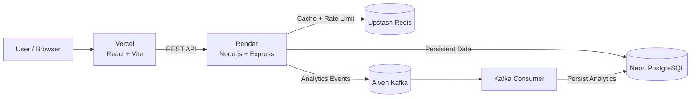

# LLIVE LINK -> https://shrinkx-sigma.vercel.app

# ShrinkX — Distributed URL Shortener & Analytics Platform

> A production-oriented URL shortener built to learn **scalable backend architecture, caching, event-driven systems, performance engineering, failure handling, and cloud deployment**.

ShrinkX started as a simple URL shortener and evolved into a distributed backend using **Node.js, PostgreSQL, Redis, Kafka, Docker, and cloud-managed infrastructure**.

The project follows a practical engineering loop:

**Build → Measure → Find bottlenecks/failures → Improve → Test again**

---

## Features

- Generate short URLs using **Base62 encoding**
- Redis caching for low-latency redirects
- Redis-based API rate limiting
- PostgreSQL as the persistent source of truth
- Asynchronous click analytics using **Apache Kafka**
- Analytics dashboard with URL and click statistics
- Dockerized backend and local infrastructure
- Cloud deployment using Render, Vercel, Neon, Upstash, and Aiven
- Load testing with **k6**
- Failure testing for Redis, Kafka, PostgreSQL, consumer, and backend failures
- Layered backend architecture with routes, controllers, services, and repositories

---

## Architecture



### Request flow

```text
                    ┌──────────────┐
                    │   Frontend   │
                    └──────┬───────┘
                           │
                           ▼
                  ┌─────────────────┐
                  │ Express Backend │
                  └───────┬─────────┘
                          │
              ┌───────────┼───────────┐
              │           │           │
              ▼           ▼           ▼
           Redis     PostgreSQL     Kafka
          Cache/       Source of    Analytics
        Rate Limit       Truth        Events
                                      │
                                      ▼
                                Kafka Consumer
                                      │
                                      ▼
                                  PostgreSQL
```

---

# Tech Stack

| Layer | Technologies |
|---|---|
| Frontend | React, Vite, Tailwind CSS, React Router |
| Backend | Node.js, Express.js |
| Database | PostgreSQL |
| Cache | Redis, ioredis |
| Messaging | Apache Kafka, KafkaJS |
| Containerization | Docker, Docker Compose |
| Frontend Deployment | Vercel |
| Backend Deployment | Render |
| Cloud Database | Neon PostgreSQL |
| Cloud Cache | Upstash Redis |
| Cloud Kafka | Aiven |
| Load Testing | k6 |

---

# Run Locally

## Prerequisites

Make sure you have:

- Node.js
- npm
- Docker Desktop
- Git
- k6 - only required for load testing

---

## 1. Clone the repository

```bash
git clone https://github.com/intensity4143/url_shortener.git
cd url_shortener
```

---

## 2. Start local infrastructure

From the project root:

```bash
docker compose up -d
```

Check the running containers:

```bash
docker ps
```

The Docker setup is used for the local infrastructure required by the application.

To stop the infrastructure:

```bash
docker compose down
```

---

## 3. Configure the backend

```bash
cd backend
npm install
```

Create a `.env` file from `.env.example` and configure the required PostgreSQL, Redis, and Kafka variables.

For local Aiven Kafka usage, the CA certificate should be available at the path configured by:

```env
KAFKA_CA_PATH=./certs/aiven-ca.pem
```

**Never commit real credentials or certificates to Git.**

---

## 4. Start the backend

```bash
node server.js
```

The backend uses:

```text
http://localhost:5000
```

when running with the project's local configuration.

---

## 5. Start the Kafka consumer

Open another terminal:

```bash
cd backend
node consumer.js
```

The consumer listens to the Kafka `analytics-events` topic and persists analytics events into PostgreSQL.

---

## 6. Start the frontend

Open another terminal:

```bash
cd frontend
npm install
npm run dev
```

Vite will display the local frontend URL, normally:

```text
http://localhost:5173
```

---

# Core API

## Generate a short URL

```http
POST /api/generate
```

Request:

```json
{
  "originalUrl": "https://example.com"
}
```

Flow:

```text
Client
  |
  v
POST /api/generate
  |
  v
Rate Limiter
  |
  v
Redis: url:long:<originalUrl>
  |
  +-- Hit --> return existing short code
  |
  +-- Miss
       |
       v
     PostgreSQL lookup
       |
       +-- Exists --> cache + return
       |
       v
     PostgreSQL identity/sequence ID
       |
       v
     Base62 encoding
       |
       v
     Insert URL
       |
       v
     Cache both mappings
       |
       v
     Return short code
```

---

## Redirect

```http
GET /:shortCode
```

Example:

```text
GET /abc123
```

Flow:

```text
Client
  |
  v
GET /:shortCode
  |
  v
Rate Limiter
  |
  v
Redis: url:short:<shortCode>
  |
  +-- Hit --> 302 Redirect
  |              |
  |              +--> Kafka analytics event
  |
  +-- Miss
       |
       v
     PostgreSQL
       |
       +-- Not found --> 404
       |
       v
     Populate Redis
       |
       v
     302 Redirect
       |
       +--> Kafka analytics event
```

---

# Analytics API

| Endpoint | Purpose |
|---|---|
| `GET /api/analytics/overview` | Overall URL/click statistics |
| `GET /api/analytics/clicks-over-time` | Clicks over the last 7 days |
| `GET /api/analytics/top-urls` | Highest-traffic URLs |
| `GET /api/analytics/recent-activity` | Recent click activity |
| `GET /api/analytics/url-overview/:shortCode` | Statistics for one URL |

Analytics processing does not block the redirect request; see the [Kafka Analytics Pipeline](#kafka-analytics-pipeline) section for how events flow from redirect to database.

---

# Kafka Analytics Pipeline

Analytics processing is separated from the latency-sensitive redirect path.

```text
Redirect
   |
   +--> immediate HTTP response
   |
   +--> Kafka event
           |
           v
    analytics-events
           |
           v
       Consumer
           |
           v
     PostgreSQL
```

Topic:

```text
analytics-events
```

Consumer group:

```text
analytics-group
```

Example event:

```json
{
  "shortCode": "abc123",
  "timestamp": "2026-09-19T12:00:00.000Z"
}
```

The redirect path does not wait for the analytics database insert.

---

# Redis Caching

ShrinkX maintains two important Redis mappings.

### Long URL → Short Code

```text
url:long:<originalUrl> -> <shortCode>
```

Used during generation to quickly detect previously shortened URLs.

### Short Code → Original URL

```text
url:short:<shortCode> -> <originalUrl>
```

Used during redirects because redirect traffic is read-heavy.

The current cache TTL is:

```text
1800 seconds
```

The implementation follows a cache-aside pattern:

```text
Redis lookup
   |
   +-- Hit --> return
   |
   +-- Miss
         |
         v
       PostgreSQL
         |
         v
       Populate Redis
```

---

# Rate Limiting

The API uses a Redis-based fixed-window rate limiter.

Conceptually:

```text
INCR rate:<operation>:<ip>
        |
        +-- first request --> EXPIRE
        |
        +-- within limit --> continue
        |
        +-- over limit ---> HTTP 429
```

Different limits can be configured for different operations. The limiter uses Redis `INCR` and `EXPIRE`.

### Failure behavior

The limiter is intentionally **fail-open**:

```text
Redis unavailable
      |
      v
Rate limiter error
      |
      v
Request continues
```

This keeps Redis from becoming a hard availability dependency for the core API. The trade-off is that rate limiting cannot be enforced while Redis is unavailable.

---

# Database

## URLs

```sql
CREATE TABLE urls (
    id BIGINT GENERATED ALWAYS AS IDENTITY PRIMARY KEY,
    original_url TEXT NOT NULL,
    short_code VARCHAR(20) UNIQUE NOT NULL,
    created_at TIMESTAMPTZ NOT NULL DEFAULT NOW()
);
```

## Analytics Events

```sql
CREATE TABLE analytics_events (
    id BIGINT GENERATED ALWAYS AS IDENTITY PRIMARY KEY,
    short_code VARCHAR(20) NOT NULL,
    visited_at TIMESTAMPTZ NOT NULL DEFAULT NOW()
);

CREATE INDEX idx_analytics_short_code
ON analytics_events(short_code);
```

PostgreSQL remains the persistent source of truth while Redis serves as the performance layer.

---

# Base62 URL Generation

The project uses:

```text
0123456789ABCDEFGHIJKLMNOPQRSTUVWXYZabcdefghijklmnopqrstuvwxyz
```

A PostgreSQL-generated numeric ID is converted into a compact Base62 short code.

```text
PostgreSQL ID
     |
     v
Base62 encoder
     |
     v
Short Code
```

For reference:

```text
62^6 ≈ 56.8 billion
```

The database-generated ID provides uniqueness without requiring random-code collision retries.

---

# Project Structure

```text
url_shortener/
│
├── backend/
│   ├── certs/
│   │   └── aiven-ca.pem
│   ├── config/
│   │   ├── database.js
│   │   ├── kafka.js
│   │   └── redis.js
│   ├── controllers/
│   ├── kafka/
│   ├── middleware/
│   ├── repository/
│   ├── routes/
│   ├── services/
│   ├── utils/
│   ├── consumer.js
│   ├── server.js
│   ├── Dockerfile
│   ├── .dockerignore
│   ├── .env.example
│   ├── package.json
│   └── package-lock.json
│
├── frontend/
│   ├── src/
│   ├── public/
│   ├── package.json
│   └── ...
│
├── load-testing/
│   └── generate-test.js
│
├── docker-compose.yml
├── .gitignore
├── README.md
└── ...
```

### Backend layers

```text
Routes
  ↓
Controllers
  ↓
Services
  ↓
Repositories
  ↓
PostgreSQL
```

- **Routes** — HTTP endpoint mapping
- **Controllers** — request/response handling
- **Services** — business logic
- **Repositories** — database operations
- **Config** — database, Redis, and Kafka clients
- **Middleware** — cross-cutting concerns such as rate limiting

---

# Docker

The backend uses a Node.js 22 Alpine image:

```dockerfile
FROM node:22-alpine

WORKDIR /app

COPY package*.json ./

RUN npm ci --omit=dev

COPY . .

EXPOSE 5000

CMD ["node", "server.js"]
```

Docker was also used locally for PostgreSQL, Redis, and Kafka.

This provides a reproducible development environment and a production-style container for deployment.

---

# Deployment

ShrinkX uses managed cloud infrastructure:

| Component | Platform |
|---|---|
| Frontend | Vercel |
| Backend | Render |
| PostgreSQL | Neon |
| Redis | Upstash |
| Kafka | Aiven |
| Containerization | Docker |

```text
                     Internet
                        │
              ┌─────────┴─────────┐
              ▼                   ▼
         Vercel Frontend     Render Backend
                                  │
                       ┌──────────┼──────────┐
                       ▼          ▼          ▼
                    Upstash     Neon       Aiven
                     Redis    PostgreSQL    Kafka
                                             │
                                             ▼
                                      Kafka Consumer
                                             │
                                             ▼
                                           Neon
```

The backend listens on `process.env.PORT`, allowing Render to provide the runtime port.

Kafka TLS/SASL credentials and the Aiven CA certificate are supplied through environment variables and secret files rather than committed to the repository.

---

# Performance

Load testing was performed using **k6** with real measurements from the Dockerized application.

## `POST /api/generate`

**200 VUs · 20 seconds**

| Metric | Result |
|---|---:|
| Requests | 51,597 |
| Throughput | **2,574.56 RPS** |
| Average | 77.51 ms |
| Median | 75.30 ms |
| p95 | **91.80 ms** |
| Max | 179.87 ms |
| Errors | **0%** |

## `GET /:shortCode`

**200 VUs · 20 seconds**

| Metric | Result |
|---|---:|
| Requests | 62,503 |
| Throughput | **3,120.05 RPS** |
| Average | 63.94 ms |
| Median | 54.22 ms |
| p95 | **105.72 ms** |
| Max | 541.96 ms |
| Errors | **0%** |
| HTTP 302 success | **100%** |

Analytics events were successfully produced during the redirect load test.

> These numbers are measured in the project's test environment and should not be interpreted as universal capacity guarantees.

### Run load tests

From the project root:

```bash
k6 run load-testing/generate-test.js
```

---

# Failure Testing

The system was intentionally tested with individual dependencies taken offline.

| Failure | Observed behavior |
|---|---|
| Redis down | Backend remains alive; caching/rate limiting fail; limiter fails open |
| Kafka down | URL generation and redirects continue; analytics events may be lost |
| Consumer down | Kafka retains events; consumer catches up after reconnect |
| PostgreSQL down | Cached redirects can continue; DB-dependent operations fail |
| Backend process killed | Container restart restores the backend |

These tests were used to understand the actual failure boundaries of the architecture rather than assuming every dependency is always available.

---

# Key Design Decisions

### PostgreSQL

Used as the persistent source of truth because the system benefits from:

- Identity/sequence generation
- Unique constraints
- Relational persistence
- SQL aggregation
- Analytics queries

### Redis

Used as a performance layer for:

- URL caching
- Redirect acceleration
- Rate limiting

### Kafka

Used to decouple analytics processing from the user-facing redirect path.

### Docker

Used for reproducible local infrastructure and production-style packaging.

### 302 redirects

Used so the application retains control over redirect behavior and analytics rather than relying on a permanently cached redirect.

---

# Current Trade-offs & Limitations

ShrinkX is a production-oriented learning project, not a globally distributed URL service.

Current limitations include:

- Single primary PostgreSQL instance
- No database replication
- No sharding
- No multi-region deployment
- IP-based rate limiting
- No authentication system
- Analytics events can be lost during Kafka outages because publishing is fire-and-forget
- Observability is not yet implemented

These limitations are intentional scope boundaries rather than hidden assumptions.

---

# Future Improvements

Planned improvements include:

- Prometheus metrics
- Grafana dashboards
- Structured logging
- Distributed tracing
- Better Kafka delivery guarantees
- Dead-letter handling
- Health-check endpoints
- Graceful shutdown
- Advanced rate limiting
- Database read replicas
- Horizontal backend scaling
- Nginx / reverse proxy
- Custom domain + HTTPS
- CI/CD
- More advanced failure injection
- Oracle Cloud deployment
- Distributed ID generation for multi-database scaling

---

# Security

Current implementation includes:

- Redis-based rate limiting
- Environment-based secrets
- Kafka TLS
- Kafka SASL/SCRAM authentication
- CORS configuration
- Secret-file handling for the Kafka CA
- Docker isolation
- No production credentials committed to Git

Real `.env` files, Kafka certificates, passwords, and connection strings should remain outside version control.

---

# Author

**Pintu Kumar**

B.Tech in Computer Science — KIET Group of Institutions

GitHub: [@intensity4143](https://github.com/intensity4143)

---

# Repository

[github.com/intensity4143/url_shortener](https://github.com/intensity4143/url_shortener)

---

## License

Add a license here when one is selected for the project.
